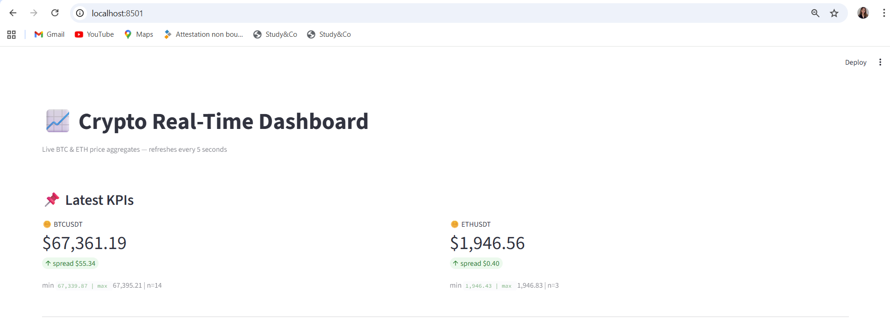
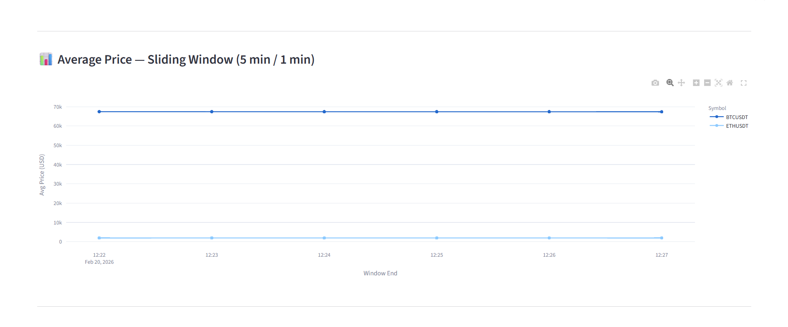
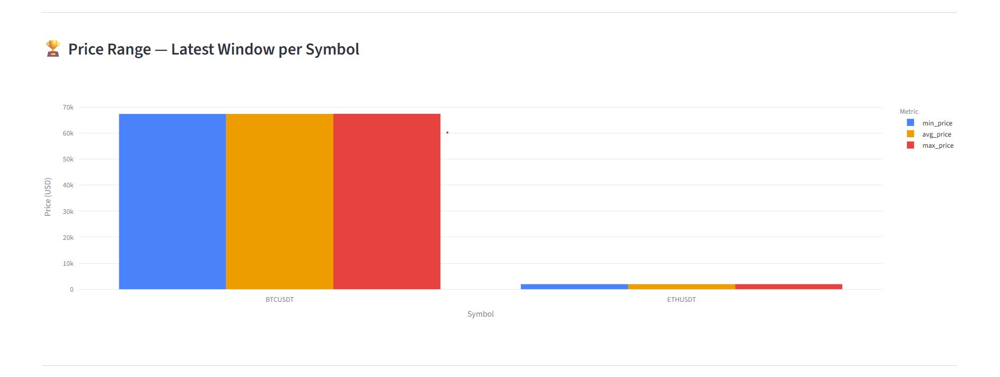
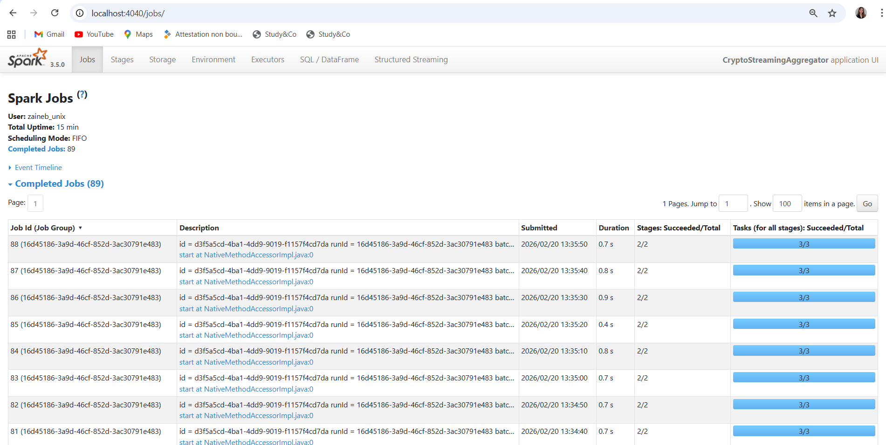
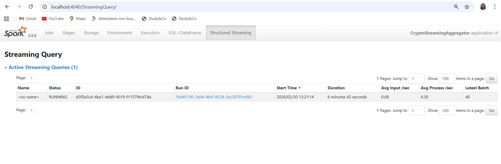

# 🚀 Real-Time Crypto Pipeline — API > Kafka > Spark > Dashboard

**Author:** [Your Name]  
**Course:** Real-Time Data Processing  
**Stack:** Python · Apache Kafka · Apache Spark Structured Streaming · Streamlit

---

## 📌 Business Scenario

This project implements a **real-time cryptocurrency price monitoring platform** for the e-commerce / financial markets scenario.

The platform continuously tracks **BTC and ETH prices** from the Binance public API, processes them through a streaming pipeline, and exposes live KPIs on an interactive dashboard.

**Business objectives:**
- Monitor price evolution in real time (every 5 seconds)
- Compute windowed statistics: average, min, max price per symbol
- Detect price spreads and volatility across sliding time windows
- Provide a live dashboard usable by trading or data teams

---

## 🏗️ Architecture

```
┌─────────────────┐     HTTP GET      ┌──────────────────┐     JSON events    ┌─────────────────────┐
│  Binance REST   │ ──────────────▶  │   api_producer   │ ─────────────────▶ │  Kafka              │
│  API (public)   │   every 5 sec    │   (Python)        │                    │  Topic: crypto-topic│
└─────────────────┘                  └──────────────────┘                    └──────────┬──────────┘
                                                                                         │ readStream
                                                                                         ▼
                                                                             ┌─────────────────────────┐
                                                                             │  Spark Structured       │
                                                                             │  Streaming              │
                                                                             │  - from_json            │
                                                                             │  - withWatermark 2min   │
                                                                             │  - window 5min / 1min   │
                                                                             │  - avg / min / max      │
                                                                             └──────────┬──────────────┘
                                                                                         │ writeStream
                                                                                         ▼
                                                                             ┌─────────────────────────┐
                                                                             │  Kafka                  │
                                                                             │  Topic: crypto-aggregates│
                                                                             └──────────┬──────────────┘
                                                                                         │ KafkaConsumer
                                                                                         ▼
                                                                             ┌─────────────────────────┐
                                                                             │  Streamlit Dashboard    │
                                                                             │  - KPI metrics          │
                                                                             │  - Time series chart    │
                                                                             │  - Bar chart            │
                                                                             └─────────────────────────┘
```

---

## 🔌 API Reference

| Field | Value |
|---|---|
| Provider | [Binance](https://binance.com) |
| Endpoint | `https://api.binance.com/api/v3/ticker/price?symbol={SYMBOL}` |
| Auth | None (public) |
| Rate limit | 1,200 requests/min |
| Format | JSON |
| Symbols used | `BTCUSDT`, `ETHUSDT` |

**Example response:**
```json
{"symbol": "BTCUSDT", "price": "97432.15"}
```

**Normalized event sent to Kafka:**
```json
{
  "symbol": "BTCUSDT",
  "price": 97432.15,
  "event_time": "2025-01-15T14:32:01.123456"
}
```

---

## 📊 KPIs Displayed

| KPI | Description | Window |
|---|---|---|
| `avg_price` | Average price per symbol | 5 min sliding / 1 min step |
| `min_price` | Minimum price per symbol | 5 min sliding / 1 min step |
| `max_price` | Maximum price per symbol | 5 min sliding / 1 min step |
| `count` | Number of events received | 5 min sliding / 1 min step |
| `spread` | max_price − min_price (volatility proxy) | Latest window |

---

## 📁 Project Structure

```
realtime-crypto-pipeline/
├── checkpoints/
│   └── crypto-aggregates/     # Spark fault-tolerance checkpoints
├── docker/
│   └── docker-compose.yml     # Kafka + Zookeeper setup
├── src/
│   ├── api_producer.py        # Binance API → Kafka producer
│   ├── streaming_app.py       # Spark Structured Streaming job
│   └── dashboard.py           # Streamlit real-time dashboard
├── logs/                      # Runtime logs (auto-created)
├── start.sh                   # One-command pipeline startup
├── stop.sh                    # One-command pipeline shutdown
├── .env.example               # Environment variable template
├── requirements.txt           # Python dependencies
└── README.md
```

---

## ⚙️ Prerequisites

- Docker & Docker Compose
- Python 3.9+
- Apache Spark 3.5+ with `spark-submit` in PATH
- Java 11 or 17 (required by Spark)

---

## 🚀 Getting Started

### 1. Clone the repository
```bash
git clone https://github.com/<your-username>/realtime-crypto-pipeline.git
cd realtime-crypto-pipeline
```

### 2. Install Python dependencies
```bash
python3 -m venv venv
source venv/bin/activate        # Windows: venv\Scripts\activate
pip install -r requirements.txt
```

### 3. Configure environment
```bash
cp .env.example .env
# No API key needed — Binance endpoint is public
```

### 4. Launch everything
```bash
chmod +x start.sh stop.sh
bash start.sh
```

This will automatically:
1. Start Kafka & Zookeeper via Docker
2. Create Kafka topics (`crypto-topic`, `crypto-aggregates`)
3. Start the API producer
4. Start the Spark streaming job
5. Start the Streamlit dashboard

### 5. Open the dashboard
```
http://localhost:8501
```

### 6. Monitor Spark
```
http://localhost:4040
```

### 7. Stop everything
```bash
bash stop.sh
```

---

## 🔧 Manual Startup (step by step)

If you prefer to run each component separately:

```bash
# Terminal 1 — Kafka
docker compose -f docker/docker-compose.yml up

# Terminal 2 — API Producer
python3 src/api_producer.py

# Terminal 3 — Spark job
spark-submit \
  --packages org.apache.spark:spark-sql-kafka-0-10_2.12:3.5.0 \
  src/streaming_app.py

# Terminal 4 — Dashboard
streamlit run src/dashboard.py
```

---

## 🛡️ Technical Decisions

### Watermark — 2 minutes
The API is polled every 5 seconds with very low network latency. A 2-minute watermark is sufficient to handle any delayed events while keeping state memory low.

### Sliding window — 5 min / 1 min
A 5-minute window provides enough data points for meaningful statistics. The 1-minute slide gives frequent updates without overloading Spark.

### `outputMode("update")`
Used instead of `complete` to avoid rewriting all historical windows on every micro-batch — more efficient for long-running jobs.

### Checkpoint
Located at `./checkpoints/crypto-aggregates`. Allows the Spark job to resume exactly where it left off after a restart, without reprocessing old data.

### Session state in Streamlit
The Kafka consumer is recreated on every Streamlit rerun (every 5s). Session state accumulates records across reruns so the charts grow over time rather than resetting.

---

## 📸 Spark UI — Monitoring

Access the Spark UI at `http://localhost:4040` while the streaming job is running.

### Dashboard — Live KPIs (BTC & ETH)


> Real-time KPI cards showing avg price, spread, min, max and event count for the latest window.

### Dashboard — Average Price Time Series


> Sliding window (5 min / 1 min) average price evolution for BTC and ETH.

### Dashboard — Price Range Bar Chart


> Min / Avg / Max price comparison per symbol for the latest window.

### Spark UI — Jobs Tab


> 33 completed jobs, each taking ~0.8s. All stages succeeded (2/2), confirming stable pipeline execution.

### Spark UI — Structured Streaming Tab


> Micro-batches trigger every 10 seconds. Processing time stays well under the trigger interval.

### Spark UI — Stages Tab


> Each stage shows the Kafka read → JSON parse → watermark → window aggregation → Kafka write pipeline.

---

## ⚠️ Limitations & Possible Improvements

| Limitation | Improvement |
|---|---|
| Single Kafka broker (no replication) | Add multiple brokers for production fault tolerance |
| Binance free tier — no historical data | Add batch backfill from a historical data source |
| Dashboard reloads full Kafka topic on restart | Persist aggregates to Parquet or a database |
| No authentication on dashboard | Add Streamlit authentication |
| No alerting | Add price spike detection and email/Slack alerts |
| Manual Spark submit | Containerize Spark job in Docker Compose |

---

## 📦 Dependencies

Key packages (see `requirements.txt` for full list):

| Package | Version | Purpose |
|---|---|---|
| `kafka-python` | 2.3.0 | Kafka producer & consumer |
| `pyspark` | 3.5.x | Spark Structured Streaming |
| `streamlit` | latest | Real-time dashboard |
| `plotly` | latest | Interactive charts |
| `streamlit-autorefresh` | latest | Auto-refresh widget |
| `requests` | 2.25.1 | Binance API calls |